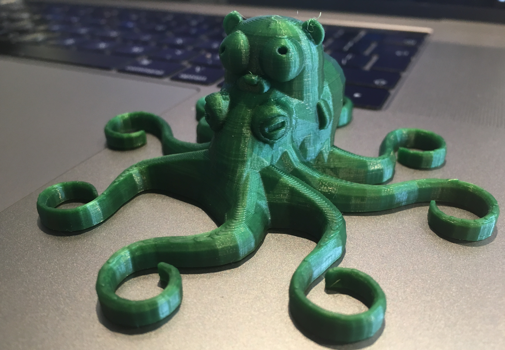

# Octopus



## Overview

Octopus is a testing framework that allows you to run tests defined as Docker images on a running cluster.
It was created to replace the `helm test` by providing these additional features:
- Selective testing, which is especially useful for local development when you want to execute only tests that local changes can affect.
- Automatic retries on failed tests, which is a remedy for flaky tests. 
- Running tests multiple times, which is helpful when you add a new test and you want to validate if it is stable, or when you want to reproduce a problem that occurs on CI.
- Full support for concurrent testing, which allows you to specify how many tests should be executed at the same time.

Octopus provides integration with `kubectl`. For more information, read [this](./docs/kubectl-integration.md) document.

## Prerequisites

Use the following tools to set up the project:

* Version 1.11 or higher of [Go](https://golang.org/dl/)
* Version 0.5.1 or higher of [Dep](https://github.com/golang/dep)
* Version 2.0.0 of [Kustomize](https://github.com/kubernetes-sigs/kustomize)
* Version 1.0.7 of [Kubebuilder](https://github.com/kubernetes-sigs/kubebuilder)
* The latest version of [Docker](https://www.docker.com/)
* The latest version of [Mockery](https://github.com/vektra/mockery) 

## Installation
To install the Octopus [helm](https://helm.sh/) chart on a cluster, run the following command:
```
helm install ./chart/octopus/ --name={release name} --namespace={namepsace}
```

## Development

### Install dependencies

This project uses `dep` as the dependency manager. To install all required dependencies, use the following command:
```bash
make resolve
```

### Run tests

To test your changes before each commit, use the following command:

```bash
make validate
```

### Upgrade chart
Chart `chart/octopus` is upgraded manually, by copying respective files from the `config` directory.
